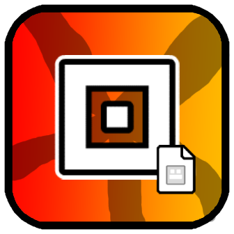

# Save your icon set

A Geometry Dash mod that allows you to save and manage multiple icon sets, making it easy to switch between different looks instantly!

## Features

- **Save up to 50 icon sets** - Store all your favorite icon combinations
- **Quick switch** - Load any saved set with one click
- **Easy management** - Rename, update, or delete your saved sets
- **Clean UI** - Simple and intuitive interface integrated into the garage

## How to Use

1. Open the **Garage** (icon selection screen)
2. Set up your icons the way you want
3. Click the **manager button** in the top-left corner
4. Click **"Add New Set"** to save your current setup
5. To load a set, click **"Load"** on any saved set
6. Use **"Save"** to update an existing set with your current icons

## Tips

- Give your sets descriptive names to easily find them later
- You can have different sets for different level styles
- Update existing sets anytime by clicking "Save"

## Support

If you encounter any issues or have suggestions, feel free to report them on the mod's page!
